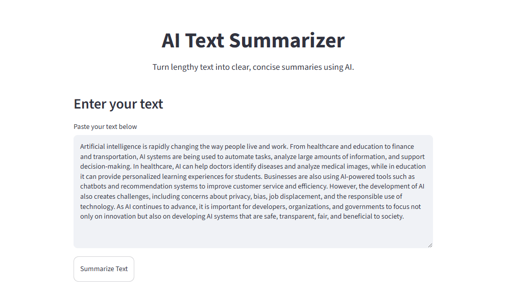
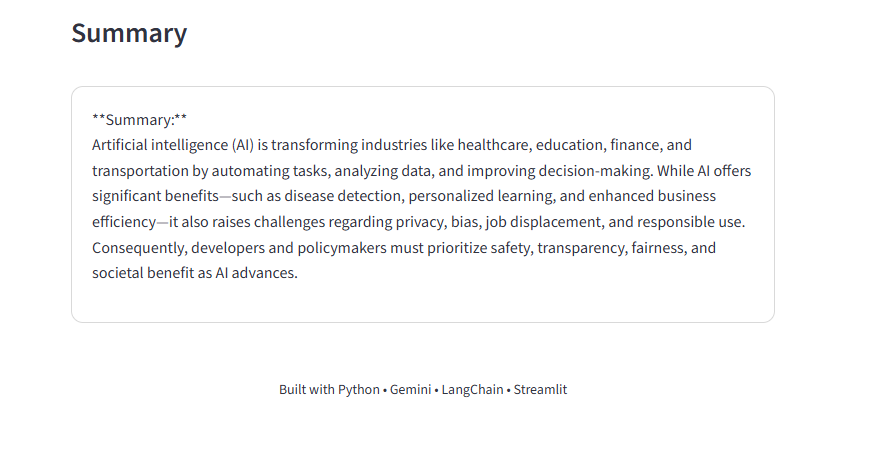

# AI Text Summarizer

An AI-powered web application that summarizes lengthy text into clear and concise summaries using Google Gemini, LangChain, and Streamlit.

This is one of my first projects as I begin exploring Artificial Intelligence, Large Language Models (LLMs), and Generative AI.

## Features

* Summarizes user-provided text using Google Gemini
* Generates clear and concise summaries
* Uses prompt engineering to improve the summarization process
* Provides a simple and interactive web interface
* Shows a loading indicator while the AI generates the summary
* Keeps API credentials secure using environment variables

## Technologies Used

* **Python**
* **Google Gemini**
* **LangChain**
* **Streamlit**
* **python-dotenv**
* **Git & GitHub**

## Project Structure

```text
AI-Text-Summarizer/
│
├── text-summarizer.py
├── requirements.txt
├── .gitignore
└── README.md
```

The `.env` file and virtual environment are not included in the repository to keep sensitive information and unnecessary files out of GitHub.

## How to Run

### 1. Clone the repository

```bash
git clone https://github.com/ManahilShabbir/AI-Text-Summarizer.git
```

### 2. Open the project folder

```bash
cd AI-Text-Summarizer
```

### 3. Create a virtual environment

```bash
python -m venv venv
```

### 4. Activate the virtual environment

On Windows:

```bash
venv\Scripts\activate
```

### 5. Install the required packages

```bash
pip install -r requirements.txt
```

### 6. Add your Gemini API key

Create a `.env` file in the project folder and add:

```text
GOOGLE_API_KEY=your_api_key_here
```

Make sure you never upload your `.env` file or API key to GitHub.

### 7. Run the application

```bash
streamlit run text-summarizer.py
```

The application will open in your web browser.

## Screenshots

### Application Interface

Add a screenshot of the application here.



### Generated Summary

Add a screenshot showing the generated summary here.



## What I Learned

Building this project helped me understand how to:

* Connect a Python application with an LLM
* Work with the Google Gemini API
* Use LangChain to interact with a language model
* Write prompts for better AI-generated summaries
* Build a simple AI web application using Streamlit
* Use environment variables to protect API credentials
* Use Git and GitHub for version control
* Turn an AI concept into a working application

## Future Improvements

I plan to improve this project by adding:

* PDF and document upload support
* Multiple language support
* Different summary length options
* Word and character counting
* Copy and download summary options
* More customizable prompts
* Further improvements to the user interface

## About This Project

This project is an important first step in my journey toward becoming an AI Engineer.

I am currently learning more about Artificial Intelligence, Machine Learning, Large Language Models, and Generative AI while building practical projects to strengthen my skills.

More projects coming soon.
